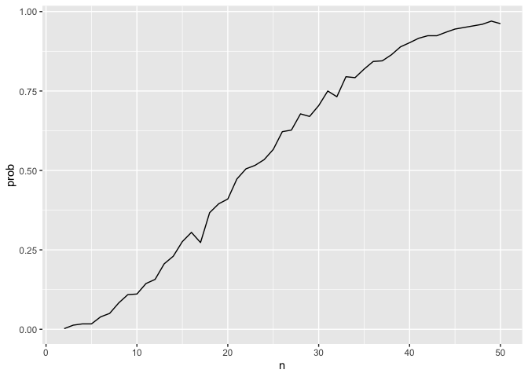
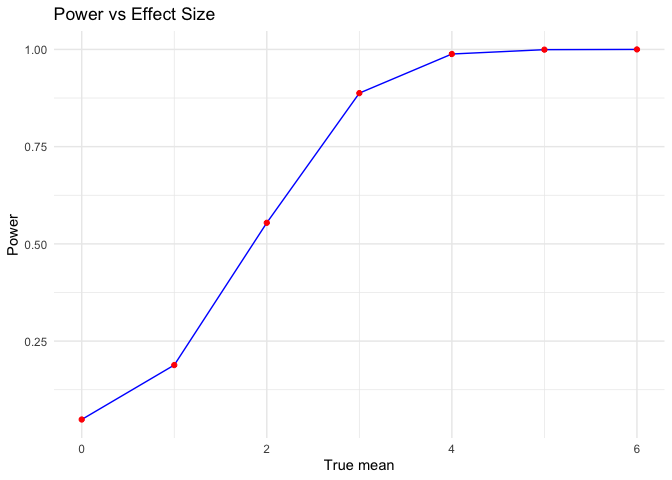
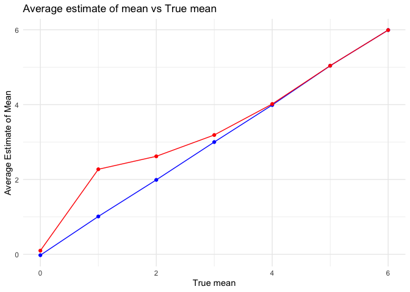
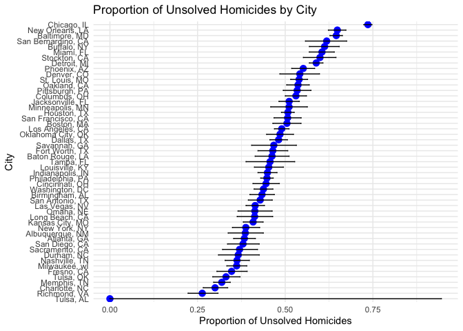

p8105_hw5_sr4081
================
Samiha Reza
2024-11-15

## Problem 1

``` r
birth_sim = function(n){
  birthday = sample(1:365, size = n, replace = TRUE)
  
  duplicate = length(unique(birthday)) < n 
  
  return(duplicate)
  
}

birth_sim(50)
```

    ## [1] TRUE

``` r
sim_res = 
  expand_grid(
    n = 2:50,
    iter = 1:1000
  ) |>
  mutate(res = map_lgl(n, birth_sim)) |>
  group_by(n) |>
  summarize(prob = mean(res))

sim_res |>
  ggplot(aes(x= n, y = prob)) +
  geom_line()
```

<!-- -->

## Problem 2

Below is the function to create samples of 30 from 5000 random datasets.
Then I found the means, and did a one-sample t-test for each, comparing
the mean to the null hypothesis mu = 0, and found the power of each one.

``` r
n <- 30
sigma <- 5
mu_values <- 0:6
n_datasets <- 5000
alpha <-0.05

set.seed(10)

power_results <- vector ("list", length(mu_values))

for (i in seq_along(mu_values)) {
  mu <- mu_values[i]

results <- replicate(n_datasets, {
    x = rnorm(n, mean = mu, sd = sigma)
    t_test <- t.test(x, mu=0)

    tidy_t_test <- broom::tidy(t_test)
    tidy_t_test$mu <- mu
    tidy_t_test[c("estimate", "p.value", "mu")]
}, simplify = FALSE)

results_df <- do.call(rbind, results)
colnames(results_df) <- c("mu_hat", "p_value", "mu")


power <- mean(results_df$p_value < alpha)


avg_mu_hat <- mean(results_df$mu_hat)
avg_mu_hat_rejected <- mean(results_df$mu_hat[results_df$p_value < alpha])


power_results[[i]] <- data.frame(mu=mu, 
                                 power=power,
                                 avg_mu_hat=avg_mu_hat,
                                 avg_mu_hat_rejected=avg_mu_hat_rejected)

}

final_results_df <- do.call(rbind, power_results)


head(final_results_df)
```

    ##   mu  power  avg_mu_hat avg_mu_hat_rejected
    ## 1  0 0.0484 -0.02322427          0.09830947
    ## 2  1 0.1884  1.01178046          2.27241568
    ## 3  2 0.5542  1.98914725          2.61868664
    ## 4  3 0.8876  2.99978138          3.18812983
    ## 5  4 0.9882  3.98903568          4.01636113
    ## 6  5 0.9994  5.03781256          5.03973324

``` r
ggplot(final_results_df, aes(x = mu, y = power)) + 
  geom_line(color = "blue") +
  geom_point(color = "red") +
  labs(
    title = "Power vs Effect Size", 
    x = "True mean",
    y = "Power"
  ) + 
  theme_minimal()
```

<!-- --> As the true
value of mean increases, the power increases as well. This indicates how
effect size and power are directly proportional.

``` r
ggplot(final_results_df, aes (x = mu, y = avg_mu_hat)) + 
  geom_line(aes(y = avg_mu_hat), color = "blue") +
  geom_point(aes(y=avg_mu_hat), color = "blue") +
  
  geom_line(aes(y=avg_mu_hat_rejected), color = "red") +
  geom_point(aes(y=avg_mu_hat_rejected), color = "red") +
  labs(
    title = "Average estimate of mean vs True mean", 
    x = "True mean",
    y = "Average Estimate of Mean"
  ) + 
  theme_minimal()
```

<!-- --> The blue line
refers to the average estimate of mean for all generated p-values; the
estimates are close to the true mean. The red line refers to the average
estimate of mean for p-values that rejected the null hypothesis. The
sample average for the rejected null p-values is not approximately equal
when the true mean is smaller because of the affect on effect size and
power.

## Problem 3

``` r
url <- "https://raw.githubusercontent.com/washingtonpost/data-homicides/master/homicide-data.csv"
download.file(url, destfile = "homicide-data.csv")

homicide_data <- read.csv(url) %>%
    janitor::clean_names() %>%
    mutate(city_state = paste(city, state, sep = ", ")
)

homicide_summary <- homicide_data %>%
  mutate(unsolved = ifelse(disposition %in% c("Closed without arrest", "Open/No arrest"), 1, 0)
         ) %>%
  group_by(city_state) %>%
  summarise(
    total_homicide = n(),
    unsolved_homicides = sum(unsolved),
    .groups = "drop"
  )

print(homicide_summary)
```

    ## # A tibble: 51 × 3
    ##    city_state      total_homicide unsolved_homicides
    ##    <chr>                    <int>              <dbl>
    ##  1 Albuquerque, NM            378                146
    ##  2 Atlanta, GA                973                373
    ##  3 Baltimore, MD             2827               1825
    ##  4 Baton Rouge, LA            424                196
    ##  5 Birmingham, AL             800                347
    ##  6 Boston, MA                 614                310
    ##  7 Buffalo, NY                521                319
    ##  8 Charlotte, NC              687                206
    ##  9 Chicago, IL               5535               4073
    ## 10 Cincinnati, OH             694                309
    ## # ℹ 41 more rows

The dataset has 52179 observations and 13 variables. The variables
include uid, reported_date, victim_last, victim_first, victim_race,
victim_age, victim_sex, city, state, lat, lon, disposition, city_state.

``` r
baltimore_data <- homicide_data %>%
  filter(city_state == "Baltimore, MD")

unsolved_count <- sum(baltimore_data$disposition %in% c("Closed without arrest", "Open/No arrest"))
total_count <- nrow(baltimore_data)


prop_test_result <- prop.test(unsolved_count, total_count)


tidy_result <- broom::tidy(prop_test_result)

tidy_result %>%
  select(estimate, conf.low, conf.high)
```

    ## # A tibble: 1 × 3
    ##   estimate conf.low conf.high
    ##      <dbl>    <dbl>     <dbl>
    ## 1    0.646    0.628     0.663

``` r
results <- homicide_summary %>%
  mutate(
    test_result = purrr::map2(unsolved_homicides, total_homicide, ~prop.test(.x, .y)),
    tidy_result = purrr::map(test_result, broom::tidy)
  ) %>%
  unnest(tidy_result) %>%
  select(city_state, estimate, conf.low, conf.high)
```

    ## Warning: There was 1 warning in `mutate()`.
    ## ℹ In argument: `test_result = purrr::map2(...)`.
    ## Caused by warning in `prop.test()`:
    ## ! Chi-squared approximation may be incorrect

``` r
ggplot(results, aes(x = reorder(city_state, estimate), y = estimate)) +
  geom_point(size = 3, color = "blue") +  
  geom_errorbar(aes(ymin = conf.low, ymax = conf.high), width = 0.2) +  
  labs(
    title = "Proportion of Unsolved Homicides by City",
    x = "City",
    y = "Proportion of Unsolved Homicides"
  ) +
  coord_flip() +  
  theme_minimal() +
  theme(axis.text.y = element_text(angle = 45, hjust = 1))  # Rotate x-axis labels for better fit
```

<!-- -->
